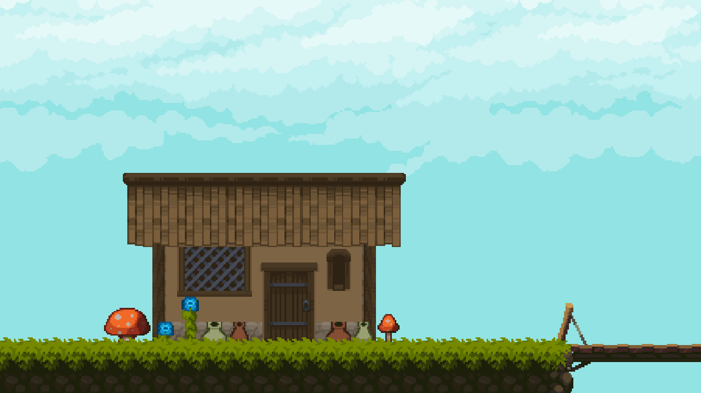

# WOODLAND

## Table of Contents

0. [Introduction](#introduction)
1. [Features](#features)
2. [Getting Started](#getting-started)
3. [Controls](#controls)
4. [Authors](#authors)
5. [About Me](#about-me)
6. [License](#license)

## Introduction

**Woodland** In this 2D platformer adventure, developed in Unity, you play as Pearl, an adventurer who wakes up in a tranquil forest, 
but something feels wrong. The vibrant world around her seems familiar, yet unsettling. As she explores deeper into the woods, strange 
changes begin to occur—things deteriorate, the environment grows more twisted, and Pearl’s sense of reality begins to blur. At first, 
the cause of these unsettling events is unclear, but as Pearl pushes forward, fragments of forgotten memories begin to resurface. The 
forest, once calm and inviting, now holds secrets that threaten not just the world around her, but her very existence.

## Features

- **Health**: Pearl starts with 3 lives
- **Wildlife**: Dangerous creatures will attack during your forest adventures
- **Coins**: Collect coins to unlock rewards
- **Movement**: Pearl can jump and move left to right 
- **Attack**: Pearl can kill creatures by jumping on top of them

## Getting Started

Download the completed game here on GitHub: [Woodland.zip](https://github.com/Collinb190/Woodland/blob/main/executable/test.txt)
- Save **Woodland.zip**
- Unzip **Woodland.zip**
- Double-click **Woodland.exe**
- Have Fun!

### Hardware

|PC   |MAC  |LINUX|
|-----|-----|-----|

## Controls

| Key    | Action       |
|--------|--------------|
| A      | Move left    |
| D      | Move right   |
| Space  | Jump         |

## Authors

Collin Ballard [GitHub](https://github.com/Collinb190)

## About Me

Hello! I am Lin, a passionate game developer with a love for creating engaging experiences. I have a background in Unity as well as
Web Development and I enjoy bringing my ideas to life. You can connect with me on [LinkedIn](https://www.linkedin.com/in/collin-ballard), 
[LinkWithLin](https://www.linkwithlin.com/), and check out my [Portfolio Project Repository](https://github.com/Collinb190).

## License

No formal license is required