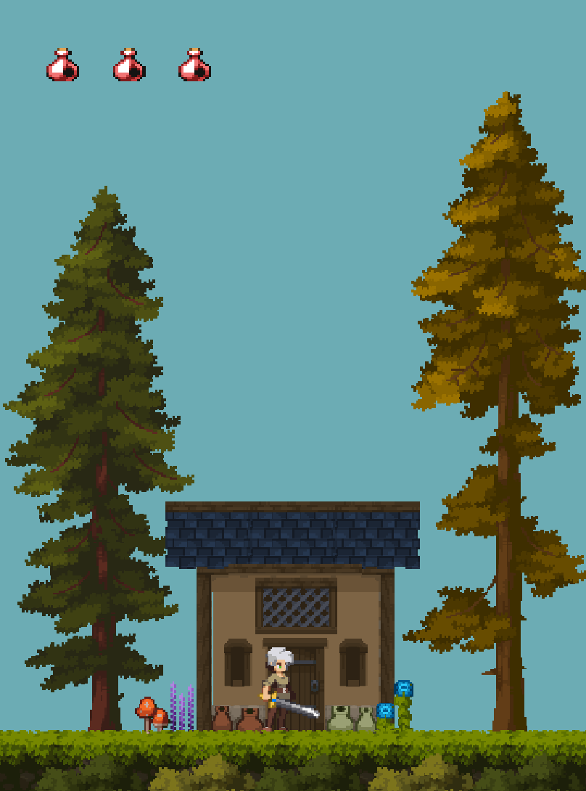

# [WOODLAND]

You are Clio. I ideal natural life is all you've ever known, but now you know your world is a lie. The fantastic land you called home was a simulation, and now you must escape. Can you make it back to reality?

## Table of Contents

1. [Features](#features)
2. [Getting Started](#getting-started)
3. [Controls](#controls)
4. [Authors](#authors)
5. [License](#license)

## Introduction

Woodland is a 2D platformer made in Unity. The goal is to make it to the end of the level with all three coins to win. Get to the end without the coins, you lose. You die, you lose!

## Features

- [Health]
    Clio starts with 3 lives. Fall off the map, and you die. Take 3 hits, you die.
- [Boars]
    Flying boars! Boars will fly at you to prevent you from escaping the simulation. 
- [Coins]
    Collect 3 coins to unlock the exit!  
- [Movement]
    Clio can jump, and move left to right. Fully animated run and jump cycles. 
- [Attack]
    Clio can kill boars by jumping up into them from underneath. Jump on top like a goomba and it'll just hurt Clio!

## Getting Started

You can download the completed game from this link: https://github.com/Collinb190/Woodland
    - Save Woodland.zip to you desired location
    - Unzip Woodland.zip
    - Double click Woodland.exe and have fun!

### Prerequisites

Works on PC, Mac, and Linux

## Controls

| Key    | Action       |
|--------|--------------|
| A      | Move left    |
| D      | Move right   |
| Space  | Jump         |

## Authors

1. Evan Markle [https://github.com/EJMarkle]
2. Collin Ballard [https://github.com/Collinb190]

## License

You got a license to play this game?
